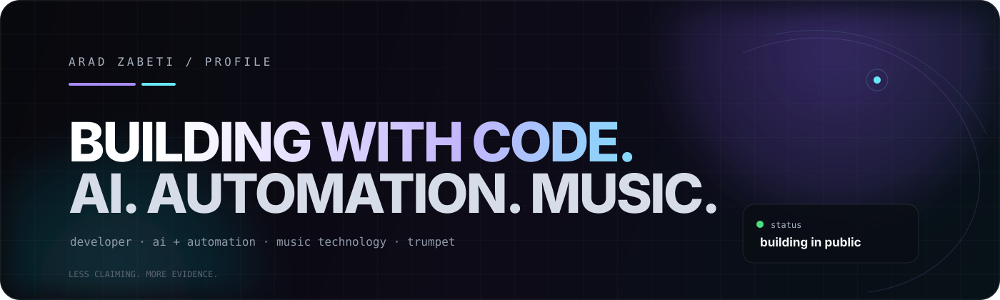
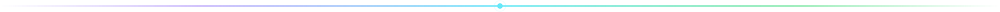
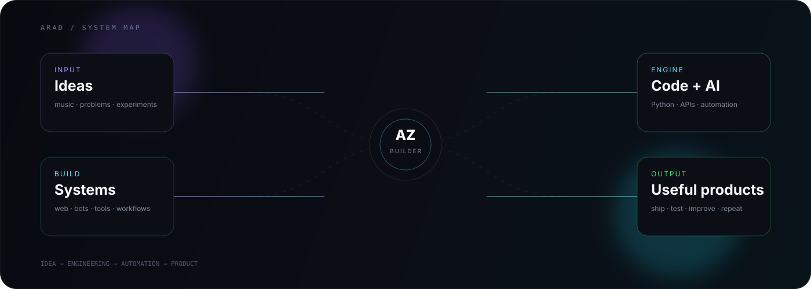

<div align="center">



<br>

[](https://aradzabeti.github.io/AradZabeti/)
[](https://aradzabeti.github.io/AradZabeti/resume.html)
[](https://github.com/AradZabeti)
[](https://kooktools.netlify.app)

</div>



## `ARAD / DEVELOPER PROFILE`

<table>
<tr>
<td width="58%" valign="top">

### I build systems, not just screens.

I work at the intersection of **software engineering, AI automation, developer tooling and music technology**.

The pattern behind most of my projects is simple:

```text
idea
  ↓
prototype
  ↓
code + interface
  ↓
APIs + automation
  ↓
test + refine
  ↓
useful product
```

I like taking an idea from a rough concept to something people can actually interact with.

</td>
<td width="42%" valign="top">

### Current signal

```yaml
name: Arad Zabeti
role: Developer
focus:
  - AI & Automation
  - Python & Backend
  - Music Technology
  - Creative Web
craft:
  - systems
  - interfaces
  - bots
  - tools
status: building in public
motto: "Less claiming. More evidence."
```

</td>
</tr>
</table>

<div align="center">

</div>


## `01 / SYSTEM MAP`

<div align="center">

</div>


## `02 / WHAT I BUILD`

<table>
<tr>
<td width="50%" valign="top">

### ⚙️ Software Systems

Web experiences, APIs, backend services and developer utilities designed around real workflows rather than isolated demos.

**Typical territory:** `Python` · `JavaScript` · `APIs` · `FastAPI` · `PostgreSQL`

</td>
<td width="50%" valign="top">

### 🤖 AI & Automation

AI-assisted workflows that connect models, messaging platforms, APIs and automation engines into repeatable systems.

**Typical territory:** `n8n` · `AI Agents` · `Telegram` · `REST APIs` · `Webhooks`

</td>
</tr>
<tr>
<td width="50%" valign="top">

### 🎵 Music Technology

Software inspired by the way musicians practice, create and interact with sound.

**Typical territory:** `Web Audio` · `MIDI` · `Practice Tools` · `Interactive Music`

</td>
<td width="50%" valign="top">

### 🧪 Experimental Builds

Small laboratories for testing ideas quickly, then turning the useful ones into maintainable projects.

**Typical territory:** `prototypes` · `automation` · `UX` · `tooling` · `experiments`

</td>
</tr>
</table>


## `03 / FEATURED WORK`

<table>
<tr>
<td width="50%" valign="top">

### 🎵 KookTools

A music-focused toolkit for practical musician utilities and interactive workflows.

**Focus**  
`music tools` `web audio` `practice` `interactive UX`

<a href="https://kooktools.netlify.app">↗ Open KookTools</a>

</td>
<td width="50%" valign="top">

### 🎺 Arad Music OS

A music-technology workspace concept combining practice, tracking, sheet music, MIDI and intelligent assistance.

**Status**  
`concept / building`

</td>
</tr>
<tr>
<td width="50%" valign="top">

### 🤖 AI Automation Lab

Experiments connecting AI, APIs, messaging platforms and workflow automation into useful systems.

**Focus**  
`AI agents` `n8n` `Telegram` `integrations`

</td>
<td width="50%" valign="top">

### 🌐 Personal Portfolio

The public portfolio and technical résumé layer of this profile.

<a href="https://aradzabeti.github.io/AradZabeti/">↗ Visit portfolio</a>

</td>
</tr>
</table>


## `04 / ENGINEERING STACK`

| Layer | Tools |
| --- | --- |
| **Languages** | `Python` · `JavaScript` · `HTML` · `CSS` |
| **Backend** | `FastAPI` · `PostgreSQL` · `Redis` · `Celery` |
| **Automation** | `n8n` · `Telegram Bots` · `REST APIs` · `Webhooks` |
| **Infrastructure** | `Linux` · `Docker` · `Nginx` · `WSL` |
| **Developer Workflow** | `Git` · `GitHub` · `VS Code` · `PyCharm` |
| **Creative Technology** | `Web Audio` · `MIDI` · `Music Software` · `Trumpet` |


## `05 / REPOSITORY ENGINEERING`

This repository is maintained as more than a profile page. It includes a dedicated portfolio, a printable CV, documentation, security guidance, contribution standards and a clean project history.

| Surface | Purpose |
| --- | --- |
| `README.md` | Public identity, projects, stack and links |
| `index.html` | Interactive portfolio |
| `resume.html` | One-page CV with print/PDF layout |
| `assets/` | Branded SVG visual system |
| `docs/ARCHITECTURE.md` | Repository structure and design principles |
| `.github/` | Issue and pull-request standards |
| `SECURITY.md` | Security reporting and public-site rules |
| `CHANGELOG.md` | Human-readable project history |
| `.editorconfig` | Consistent editor formatting |
| `.gitignore` | Local-only files and secret-safe defaults |

→ [Read the repository architecture](./docs/ARCHITECTURE.md)  
→ [Read contribution guidelines](./CONTRIBUTING.md)  
→ [Read security policy](./SECURITY.md)  
→ [Read changelog](./CHANGELOG.md)


## `06 / QUALITY STANDARD`

Every meaningful change should aim for:

```text
accurate content
      +
responsive UI
      +
accessible interaction
      +
clean repository structure
      +
security-minded handling
      +
working GitHub Pages output
```

The repository keeps a deliberately lightweight toolchain: static web files, local visual assets, documentation and GitHub Pages. The goal is to keep the public surface easy to inspect and maintain.


## `07 / GITHUB SIGNAL`

<div align="center">


<br>


<br>


</div>


## `08 / BUILDING PHILOSOPHY`

> **Make the idea visible. Make the system useful. Make the evidence speak.**

I care about the full chain: **concept → implementation → interface → automation → deployment → iteration**.

```text
01  THINK       →  define the real problem
02  BUILD       →  prototype the core idea
03  CONNECT     →  APIs, data, automation
04  POLISH      →  interaction, visuals, accessibility
05  SHIP        →  deploy something usable
06  ITERATE     →  learn from what actually works
```


## `09 / RESUME`

<div align="center">

### <a href="https://aradzabeti.github.io/AradZabeti/resume.html">OPEN THE FULL RESUME ↗</a>

A dedicated CV covering profile, capabilities, selected projects, engineering stack and current direction.

</div>


## `10 / CURRENT DIRECTION`

<table>
<tr>
<td>🧠 AI-powered automation</td>
<td>🐍 stronger Python + backend engineering</td>
</tr>
<tr>
<td>🎵 music software + interactive audio</td>
<td>🌐 polished, responsive web experiences</td>
</tr>
<tr>
<td>🔧 turning prototypes into systems</td>
<td>🚀 shipping more complete products</td>
</tr>
</table>


## `11 / CONTACT`

<div align="center">

<a href="https://aradzabeti.github.io/AradZabeti/">🌐 Portfolio</a> ·
<a href="https://github.com/AradZabeti">💻 GitHub</a> ·
<a href="https://kooktools.netlify.app">🎵 KookTools</a> ·
<a href="https://t.me/KindButSelective">✈️ Telegram</a> ·
<a href="mailto:arad23426@gmail.com">✉️ Email</a>

<br><br>


</div>

<br>

<div align="center">

### `BUILDING SOFTWARE. AUTOMATION. MUSIC TECHNOLOGY.`

<sub>Designed as a living technical profile · Updated through Git · Built in public</sub>

</div>
