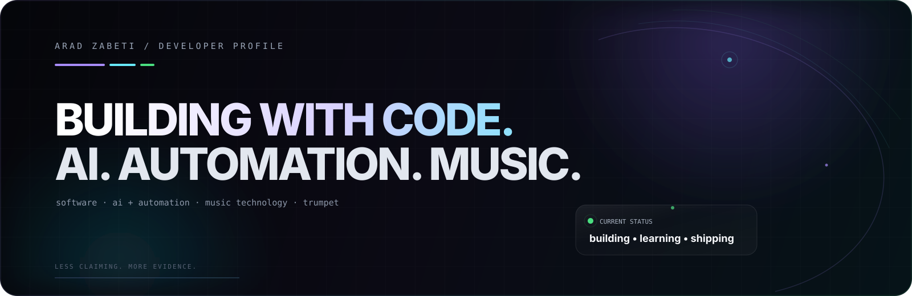
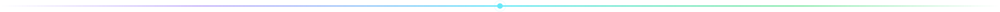

<div align="center">



<br><br>

<a href="https://aradzabeti.github.io/AradZabeti/">
  
</a>
<a href="https://aradzabeti.github.io/AradZabeti/os.html">
  
</a>
<a href="https://aradzabeti.github.io/AradZabeti/terminal.html">
  
</a>
<a href="https://aradzabeti.github.io/AradZabeti/resume.html">
  
</a>

<br><br>


<br><br>

<sub>SOFTWARE • AI AUTOMATION • MUSIC TECHNOLOGY • CREATIVE WEB</sub>

</div>



# ARAD ZABETI

> **I build systems, not just screens.**

I turn ideas into working digital products across **software engineering, AI automation, developer tooling and music technology**.

```text
IDEA
  ↓
PROTOTYPE
  ↓
ENGINEERING
  ↓
INTERFACE
  ↓
APIs + AUTOMATION
  ↓
SHIP
  ↓
ITERATE
```

<div align="center">

**Less claiming. More evidence.**

</div>

---

## `AT A GLANCE`

<table>
<tr>
<td width="50%" valign="top">

### What I build

- ⚙️ Software systems & web applications
- 🤖 AI-assisted automation
- 🔌 APIs, bots & integrations
- 🎵 Music technology & interactive audio
- 🧪 Experimental tools and prototypes

</td>
<td width="50%" valign="top">

### Core territory

`Python` · `JavaScript` · `FastAPI`  
`PostgreSQL` · `Redis` · `Docker`  
`REST APIs` · `Webhooks` · `n8n`  
`Web Audio` · `MIDI` · `Git`

</td>
</tr>
</table>

---

## `ENTER THE PROFILE`

<div align="center">

### ⌨️ [INTERACTIVE TERMINAL ↗](https://aradzabeti.github.io/AradZabeti/terminal.html)

```text
arad@profile:~$ help

about       who I am
whoami      identity summary
projects    project explorer
project     inspect a project
github      public GitHub center
stack       technologies
music       music + trumpet
matrix      easter egg
resume      full CV
contact     links
clear       clear terminal
```

### ◈ [OPEN ARAD OS ↗](https://aradzabeti.github.io/AradZabeti/os.html)

**Project Explorer · GitHub Signal · Music Mode · Command Palette · Terminal Bridge**

</div>

---

## `WHAT I BUILD`

<table>
<tr>
<td width="50%" valign="top">

### ⚙️ SOFTWARE SYSTEMS

Web experiences, APIs, backend services and developer utilities designed around real workflows.

`Python` `JavaScript` `FastAPI` `PostgreSQL`

</td>
<td width="50%" valign="top">

### 🤖 AI & AUTOMATION

Workflows that connect AI, messaging platforms, APIs and automation engines.

`AI Agents` `n8n` `Telegram` `REST` `Webhooks`

</td>
</tr>
<tr>
<td width="50%" valign="top">

### 🎵 MUSIC TECHNOLOGY

Software inspired by practice, sound, MIDI and interactive music experiences.

`Web Audio` `MIDI` `Practice Tools` `Interactive Audio`

</td>
<td width="50%" valign="top">

### 🧪 EXPERIMENTAL BUILDS

Fast experiments where useful ideas become maintainable products.

`UX` `Prototypes` `Tooling` `Experiments`

</td>
</tr>
</table>

---

## `SELECTED WORK`

<div align="center">

| PROJECT | WHAT IT IS | SIGNAL |
| :--- | :--- | :--- |
| 🎵 **[KookTools](https://kooktools.netlify.app)** | Music-focused toolkit and interactive musician utilities | `LIVE` |
| 🎺 **Arad Music OS** | Practice, tracking, sheet music, MIDI and intelligent assistance | `BUILDING` |
| 🤖 **AI Automation Lab** | AI + APIs + messaging + workflow automation experiments | `LAB` |
| 🌐 **[Personal Portfolio](https://aradzabeti.github.io/AradZabeti/)** | Interactive portfolio and technical profile | `LIVE` |

</div>

---

## `ENGINEERING STACK`

<div align="center">


</div>

| Layer | Tools |
| :--- | :--- |
| **Languages** | `Python` · `JavaScript` · `HTML` · `CSS` |
| **Backend** | `FastAPI` · `PostgreSQL` · `Redis` · `Celery` |
| **Automation** | `n8n` · `Telegram Bots` · `REST APIs` · `Webhooks` |
| **Infrastructure** | `Linux` · `Docker` · `Nginx` · `WSL` |
| **Workflow** | `Git` · `GitHub` · `VS Code` · `PyCharm` |
| **Creative Tech** | `Web Audio` · `MIDI` · `Music Software` · `Trumpet` |

---

## `GITHUB SIGNAL`

<div align="center">


<br>


<br>


</div>

---

## `BUILDING PHILOSOPHY`

<div align="center">

> **Make the idea visible. Make the system useful. Make the evidence speak.**

</div>

```text
01  THINK       →  define the real problem
02  BUILD       →  prototype the core idea
03  CONNECT     →  APIs, data, automation
04  POLISH      →  interaction, visuals, accessibility
05  SHIP        →  deploy something usable
06  ITERATE     →  improve from what actually works
```

---

## `THE REPOSITORY`

This profile repository is more than a README. It is a small public system with an interactive portfolio, terminal experience, ARAD OS layer, résumé, documentation and branded visual assets.

| Surface | Purpose |
| :--- | :--- |
| `README.md` | Public identity, projects, stack and links |
| `index.html` | Interactive portfolio |
| `terminal.html` | Shell-style profile interface |
| `os.html` | ARAD OS project explorer |
| `resume.html` | Printable CV / résumé |
| `404.html` | Interactive recovery page |
| `assets/` | Branded SVG visual system |
| `docs/` | Architecture and project documentation |
| `.github/` | Repository standards |

<div align="center">

[**OPEN ARAD OS ↗**](https://aradzabeti.github.io/AradZabeti/os.html) ·
[**OPEN TERMINAL ↗**](https://aradzabeti.github.io/AradZabeti/terminal.html) ·
[**VIEW RESUME ↗**](https://aradzabeti.github.io/AradZabeti/resume.html)

</div>

---

## `CURRENT DIRECTION`

<table>
<tr>
<td>🧠 AI-powered automation</td>
<td>🐍 Python + backend engineering</td>
</tr>
<tr>
<td>🎵 Music software + interactive audio</td>
<td>🌐 High-quality web experiences</td>
</tr>
<tr>
<td>🔧 Turning prototypes into systems</td>
<td>🚀 Shipping complete products</td>
</tr>
</table>

---

## `CONNECT`

<div align="center">

[🌐 **Portfolio**](https://aradzabeti.github.io/AradZabeti/) ·
[◈ **ARAD OS**](https://aradzabeti.github.io/AradZabeti/os.html) ·
[⌨️ **Terminal**](https://aradzabeti.github.io/AradZabeti/terminal.html) ·
[💻 **GitHub**](https://github.com/AradZabeti) ·
[🎵 **KookTools**](https://kooktools.netlify.app) ·
[✈️ **Telegram**](https://t.me/KindButSelective) ·
[✉️ **Email**](mailto:arad23426@gmail.com)

<br><br>


<br><br>

### `BUILDING SOFTWARE. AUTOMATION. MUSIC TECHNOLOGY.`

<sub>Designed as a living technical profile · Built in public · Updated through Git</sub>

</div>